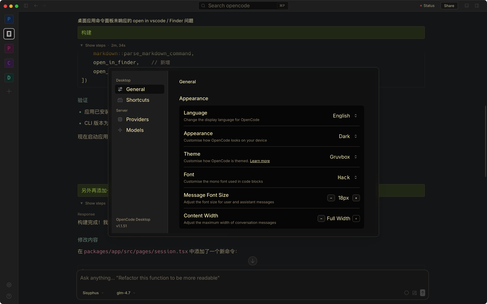
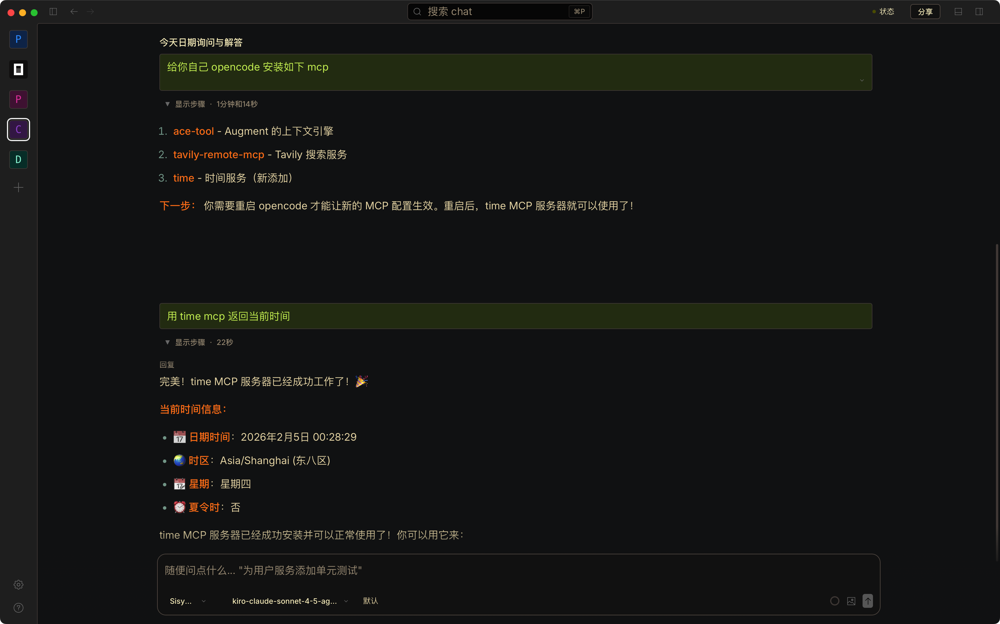
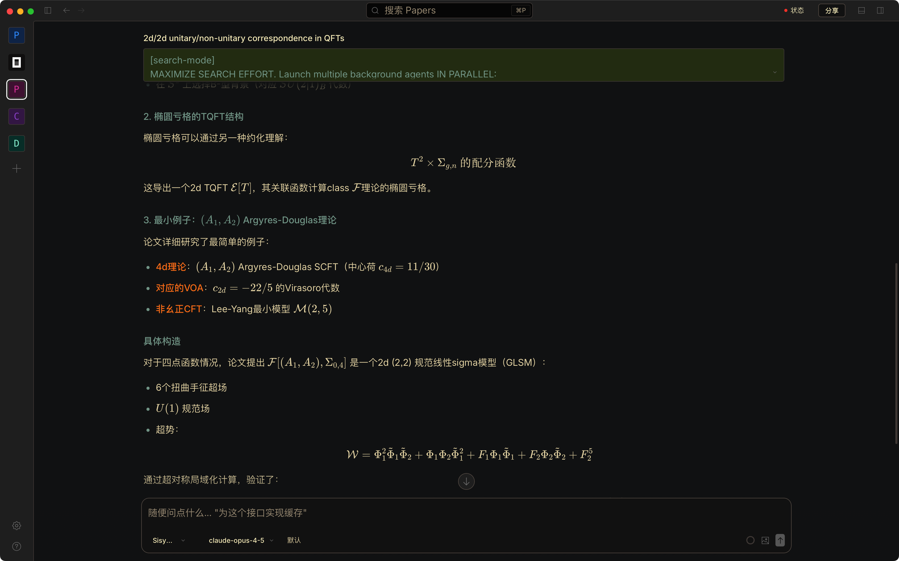

# OpenCode Desktop - 定制版

> 基于 [OpenCode](https://github.com/anomalyco/opencode) 的桌面应用定制版本

这是一个针对 OpenCode Desktop 应用进行深度 UI 优化和功能增强的个人定制版本。在保持 OpenCode 核心功能的基础上，大幅改进了用户界面交互体验和使用效率。

## ✨ 主要改进

### 🎨 UI 优化







#### 主题系统增强

- **完整主题支持**：加载了 OpenCode CLI 的所有主题配置
- **语法高亮**：AI 助手的代码回复完美应用主题配色，提供一致的视觉体验

#### 界面自定义

- **对话宽度调节**：可自由调整消息显示宽度，适配不同屏幕和使用习惯
- **字体大小设置**：支持动态调整字体大小，提升阅读舒适度
- **标题栏优化**：调整了窗口标题栏按钮高度，更加美观

#### 消息交互改进

- **快速切换项目面板**: 新增快捷键 `Cmd+T`，快速在多个项目间切换
- **消息折叠功能**：用户消息和 AI 回复支持折叠/展开，便于浏览长对话
- **Question 工具优化**：
  - 问题界面支持折叠/展开
  - 用户输入框支持多行输入，方便输入复杂内容

### ⌨️ 新增快捷键

| 快捷键          | 功能         | 说明                                    |
| --------------- | ------------ | --------------------------------------- |
| `Cmd+T`         | 项目切换面板 | 快速在多个项目间切换                    |
| `Cmd+Shift+↑/↓` | 跳转用户消息 | 在对话中快速定位到上一条/下一条用户消息 |
| `Cmd+↑/↓`       | 历史输入导航 | 载入之前的用户输入内容                  |

### 🔧 交互优化

- **对话列表触发方式改进**：点击左侧项目图标才弹出对话列表，避免误触
- **图标资源优化**：更新应用图标，减小文件体积并提升视觉效果

## 📦 安装使用

### 从源码构建

```bash
# 克隆仓库
git clone https://github.com/panyw5/opencode.git
cd opencode

# 安装依赖
bun install

# 构建桌面应用
bun run --cwd packages/desktop build
bun run --cwd packages/desktop tauri build
```

### macOS 快速构建脚本

```bash
# 一键构建并安装（macOS）
bun run --cwd packages/desktop build && \
bun run --cwd packages/desktop tauri build && \
cp /opt/homebrew/Cellar/opencode/1.1.51/bin/opencode \
  "packages/desktop/src-tauri/target/release/bundle/macos/OpenCode.app/Contents/MacOS/opencode-cli" && \
cp -R "packages/desktop/src-tauri/target/release/bundle/macos/OpenCode.app" /Applications/
```

> **注意**：当前版本需要使用稳定版本 (v1.1.51) 的 `opencode-cli` 替换构建产物，详见 [构建文档](packages/desktop/AGENTS.md)。

### 开发模式

```bash
# 启动开发服务器
bun run --cwd packages/desktop tauri dev
```

## 📖 关于 OpenCode

OpenCode 是一个开源的 AI 编码助手，具有以下特点：

- 🔓 **100% 开源** - 完全开放的代码库
- 🔌 **模型无关** - 支持 Claude、OpenAI、Google 等多种 AI 模型
- 🛠️ **LSP 支持** - 开箱即用的语言服务器协议支持
- 💻 **终端优先** - 为终端用户打造的强大 TUI 界面
- 🏗️ **客户端/服务器架构** - 灵活的部署方式

### 内置 Agent

- **build** - 默认的全功能开发 agent
- **plan** - 只读分析 agent，适合代码探索
- **general** - 用于复杂搜索和多步骤任务的子 agent

## 🔗 相关链接

- **上游项目**：[anomalyco/opencode](https://github.com/anomalyco/opencode)
- **官方网站**：[opencode.ai](https://opencode.ai)
- **官方文档**：[opencode.ai/docs](https://opencode.ai/docs)
- **Discord 社区**：[discord.gg/opencode](https://discord.gg/opencode)

## 📝 版本信息

- **基于版本**：OpenCode v1.1.51
- **定制版本**：v1.1.51-custom
- **最后同步**：2025-01

## ⚠️ 免责声明

本项目是基于 OpenCode 的个人定制版本，**不是** OpenCode 官方团队开发的产品，也**不隶属于** OpenCode 官方。

如需使用官方版本，请访问：

- 官方仓库：https://github.com/anomalyco/opencode
- 官方下载：https://opencode.ai/download

## 📄 许可证

本项目遵循与上游 OpenCode 相同的 MIT 许可证。

---

## 原版 OpenCode 安装方式

如果你想使用官方原版 OpenCode，可以通过以下方式安装：

```bash
# 快速安装
curl -fsSL https://opencode.ai/install | bash

# 包管理器
npm i -g opencode-ai@latest        # npm/bun/pnpm/yarn
brew install anomalyco/tap/opencode # macOS/Linux (推荐)
scoop install opencode             # Windows
choco install opencode             # Windows

# 桌面应用
brew install --cask opencode-desktop # macOS
scoop install extras/opencode-desktop # Windows

# 其他官方安装方式
brew install anomalyco/tap/opencode # macOS and Linux (recommended, always up to date)
brew install opencode              # macOS and Linux (official brew formula, updated less)
sudo pacman -S opencode            # Arch Linux (Stable)
paru -S opencode-bin               # Arch Linux (Latest from AUR)
mise use -g opencode               # Any OS
nix run nixpkgs#opencode           # or github:anomalyco/opencode for latest dev branch
```

更多安装选项请参考 [官方文档](https://opencode.ai/docs)。
