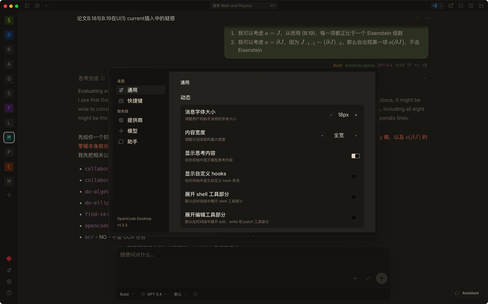
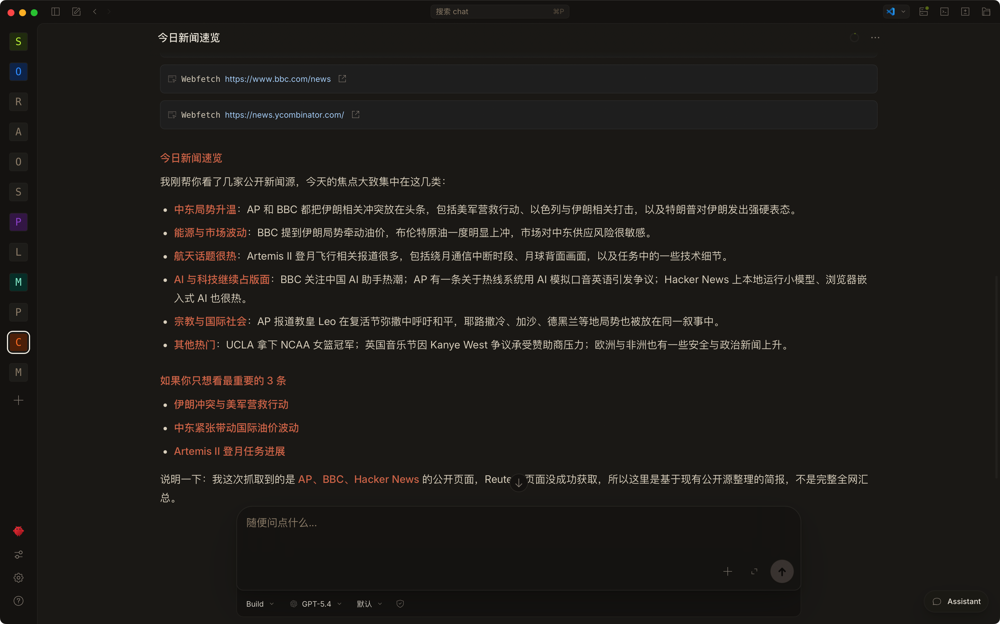
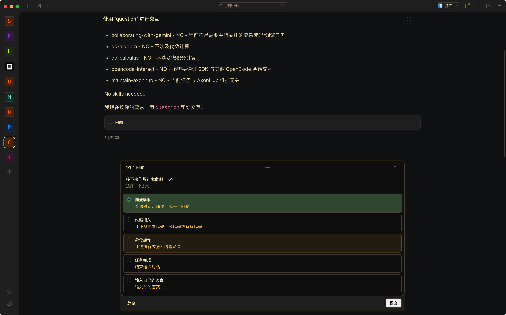
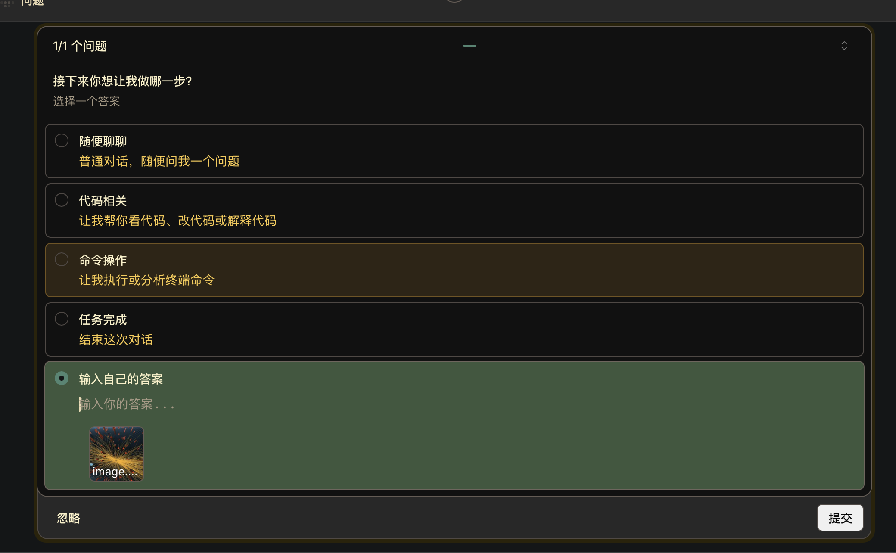
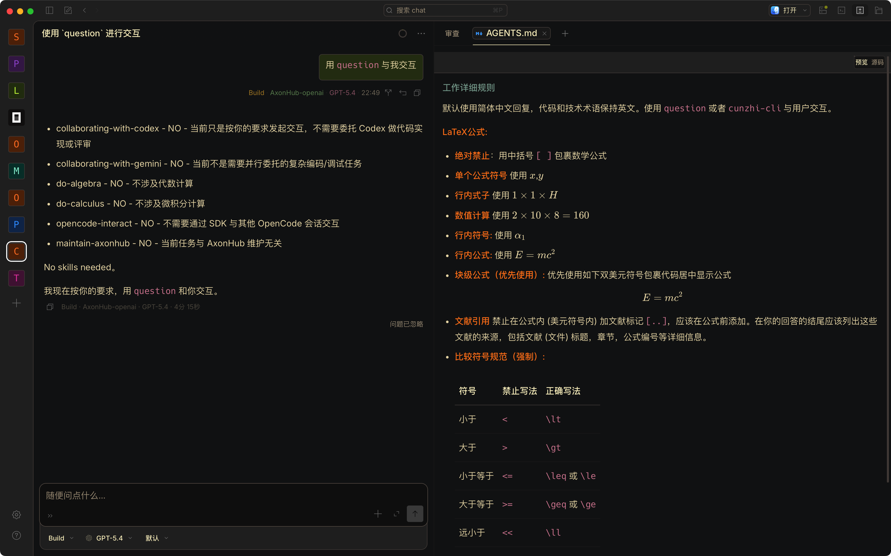
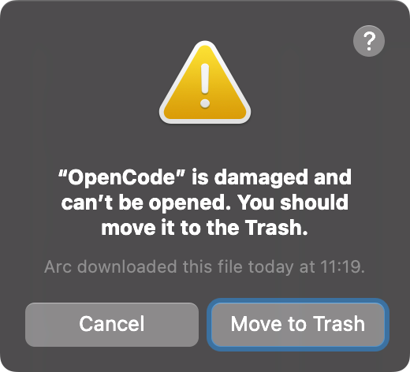

# OpenCode Studio

> 基于 [OpenCode](https://github.com/anomalyco/opencode) 的桌面应用定制版本

简体中文 | [English](README.en.md)

这是一个针对 OpenCode **Desktop** 应用进行深度 UI 优化和功能增强的个人定制版本。在保持 OpenCode 核心功能的基础上，大幅改进了用户界面交互体验和使用效率。`opencode` 的核心基本没有动/改善 (作者能力所限)。

> 作者用 MacOS 开发，目前 Windows 兼容性不佳，正在逐步解决。


## ✨ 主要改进

### OpenClaw 集成

<p align="center">
  
  
</p>


### 🎨 UI 优化

<p align="center">
  
  
  
</p>

#### 主题系统增强


- **UI性能优化**: 大幅优化了应用的响应速度和性能
- **完整主题支持**：加载了 OpenCode CLI 的所有主题配置
- **语法高亮**：AI 助手的代码回复完美应用主题配色，提供一致的视觉体验
- **Markdown 渲染**：用户消息和智能体消息添加原生 Markdown 解析器，支持 LaTeX 数学公式渲染
- **智能体消息模型信息**：在智能体消息中显示所使用的智能体、渠道、模型等元数据信息

#### 界面自定义

- **对话宽度调节**：可自由调整消息显示宽度（窄/中/宽/超宽/全宽），适配不同屏幕和使用习惯
- **字体大小设置**：支持动态调整字体大小，提升阅读舒适度
- **hooks显示**: 设置项开启在对话中显示自定义 `hooks` 调用

#### 交互改进

- **快速切换项目**: 新增快捷键 `Cmd+T`，快速在多个项目间切换
- **worktree支持**: 新建会话可以选择 worktree
- **拖放 (drag and drop) 文件夹**: 支持直接拖放文件夹到窗口打开项目
- **输入框基本自动补全**: 括号、引号等的自动补全和自动成对删除
- **快速切换项目面板**: 新增快捷键 `Cmd+T`，快速在多个项目间切换
- **助手身份显示**：会话中显示助手身份元数据
- **Question 工具优化**：
  - 支持键盘控制，`cmd+enter` 提交
  - 问题界面支持折叠/展开
  - 用户输入框支持 `enter` 多行输入，方便输入复杂内容
  - 支持粘贴图片功能
  - 用户自定义答案编辑框 `cmd+enter` 确认编辑完成
- **显示思考**: 对话中显示模型思考内容
- **SKILL**: 自动检测 `skill` 的调用并作为工具显示在对话流

- **归档**: 新增归档会话列表，可以删除归档会话，或从归档中恢复会话
- **快速打开应用**: 命令面板选择 vscode, zed, Finder, wezterm 等常见应用打开本工作区
- **隐藏主题选项**: 命令面板中将主题选项放入二级菜单中，避免误触
- **查找功能**: `cmd + F` 打开查找对话框
- **提示词编辑器**: 新增提示词编辑器，更方便输入长篇提示词，同时支持括号引号自动补全和@文件
- **md 预览**: `*.md`、`*.py`, `*.json` 等常用文件提供预览功能
- **文件跳转**: 点击文件路径，预览对应文件；`cmd/ctrl + click` 用编辑器或文件管理器打开文件 (路径)
- **重载后端**: 新增重载后端命令

#### Trellis 支持

- **任务列表**: 快速查看任务进度、`prd.md`

#### 配置面板

新增配置面板，可以在 GUI 里面直接配置如下内容
- 全局 `AGENTS.md`
- 模型供应商以及自定义类型的供应商模型
- 智能体 `.md` 文件
- 全局与项目级 skill `SKILL.md` 文件
- 插件
- `OpenClaw`, `Hermes`, `GenericAgent`

<p align="center">





</p>

### ⌨️ 新增快捷键

| 快捷键         | 功能         | 说明                                    |
| -------------- | ------------ | --------------------------------------- |
| `Cmd+T`        | 项目切换面板 | 快速在多个项目间切换                    |
| `Cmd+↑/↓`      | 跳转用户消息 | 在对话中快速定位到上一条/下一条用户消息 |
| `Cmd+.`        | 聚焦输入框   | 将光标聚焦到提示词输入框                |
| `Cmd+shift+; ` | skills 列表  | 显示当前会话中可以使用的 skill 列表     |
| `Cmd+;`        | 模型列表     | 显示可用模型列表                        |                     |

### 🖥️ 终端与编辑器集成

- **新增终端支持**：
  - Ghostty 终端集成
  - WezTerm 终端集成
- **编辑器支持**：
  - VSCode、Cursor、Sublime Text、Zed
  - 自定义编辑器路径配置
  - 在 Finder/文件管理器中打开项目


## 📦 安装使用

### 直接安装

在 [Release 页面](https://github.com/panyw5/opencode/releases) 下载最新版本的 OpenCode Desktop 应用。

#### `已损坏` 错误处理

MacOS 版本打开应用若出现`已损坏`警告，

<p align="center">
  
</p>

请打开 `terminal`，输入

```
cd /Applications
xattr -d com.apple.quarantine OpenCode.app
```
然后正常打开 `Opencode` 应用就可以了


### 从源码构建

```bash
# 克隆仓库
git clone https://github.com/panyw5/opencode.git
cd opencode

# 安装依赖
bun install

# 构建桌面应用
bun run --cwd packages/desktop package:mac
```

### macOS 快速构建脚本

```bash
# 一键构建并打开产物目录（macOS）
bun run --cwd packages/desktop package:mac && \
open packages/desktop/dist
```

> **注意**：桌面构建会自动构建并打包 CLI sidecar，详见 [构建文档](packages/desktop/AGENTS.md)。

### 开发模式

```bash
# 启动开发服务器
bun run dev:desktop
```

## 📖 关于 OpenCode

OpenCode 是一个开源的 AI 编码助手，具有以下特点：

- 🔓 **100% 开源** - 完全开放的代码库
- 🔌 **模型无关** - 支持 Claude、OpenAI、Google 等多种 AI 模型
- 🛠️ **LSP 支持** - 开箱即用的语言服务器协议支持
- 💻 **终端优先** - 为终端用户打造的强大 TUI 界面
- 🏗️ **客户端/服务器架构** - 灵活的部署方式

### 内置 Agent

- **build** - 默认的全功能开发 agent
- **plan** - 只读分析 agent，适合代码探索
- **general** - 用于复杂搜索和多步骤任务的子 agent

## 🔗 相关链接

- **上游项目**：[anomalyco/opencode](https://github.com/anomalyco/opencode)
- **官方网站**：[opencode.ai](https://opencode.ai)
- **官方文档**：[opencode.ai/docs](https://opencode.ai/docs)
- **Discord 社区**：[discord.gg/opencode](https://discord.gg/opencode)

## 📝 版本信息

- **基于版本**：OpenCode v1.3.2
- **定制版本**：v1.3.2-custom
- **最后同步**：2026-03-27

## 🔄 与上游的关系

本 fork 积极跟踪上游 OpenCode 的更新，定期合并最新功能和修复。主要差异在于：

- **UI/UX 增强**：更丰富的界面自定义选项和交互优化
- **终端集成**：额外支持 Ghostty 和 WezTerm
- **性能优化**：针对大文件和 diff 的渲染优化
- **平台特性**：macOS、Windows、Linux 平台特定功能增强

所有核心功能与上游保持一致，可随时切换回官方版本。

## ⚠️ 免责声明

本项目是基于 OpenCode 的个人定制版本，**不是** OpenCode 官方团队开发的产品，也**不隶属于** OpenCode 官方。

如需使用官方版本，请访问：

- 官方仓库：https://github.com/anomalyco/opencode
- 官方下载：https://opencode.ai/download

---

# 社区

[Linux.do](https://linux.do/t/topic/1802735)
